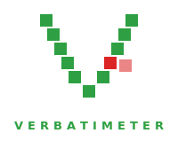

<p align="center">
  
</p>

LLMs fabricate, and they fabricate fluently — an answer that claims to be
grounded in a source cannot be taken on trust. verbatimeter verifies the
claim: give it an AI-generated text and the source it should be grounded in,
and it shows, word for word, what came from the source and what the model
introduced. The measurement is deterministic — no judge model, no embeddings,
no sampling. The same inputs produce the same numbers, every time.

For RAG agents, verification is one decorator line. Every answer — streamed
or not — comes back highlighted and measured:

```python
@verify(source_arg="context", scope="quotes")
def generate(question, context): ...
```

The same check is available as library functions and as a CLI: the numbers in
a notebook, a CI gate, and a terminal are identical.

One word-level alignment, two readings:

- **Verbatim reuse** (default) — word-for-word copying, in contiguous runs.
- **Verbatim paraphrasing** (`--subsequence`) — the source's own words reused
  in order but not contiguously: split up, rearranged, interleaved with new
  words.

What it's built for:

- **Grounding verification** — how much of an answer, summary, or report comes
  directly from its source, and how much is verbatim-paraphrased from it.
- **Hallucination gating** (`--quotes`) — have the model support its answer
  with verbatim quotations, verify each one, and fail the pipeline on
  fabrications. A deterministic *lower bound* on grounding failures.
- **Multilingual** — any language that separates words with spaces, with
  Unicode-normalized, case-folded matching. Validated on eleven languages,
  from English and French to Hindi, Urdu, and Arabic; quotation extraction
  understands `"…"`, `“…”`, `« … »`, and `„…“`. Unsegmented scripts (Chinese,
  Japanese, Thai) are not yet supported.
- **Lightweight and offline** — one runtime dependency (`tiktoken`), with the
  vocabulary bundled: no network access, ever.

Scope is deliberately narrow: it verifies, highlights, and collects statistics on
text you provide. Extracting text from PDFs, Word documents, HTML, and other
formats is out of scope — perform the extraction with the library of your
choice, then pass the resulting text in.

## Demo

<p align="center"></p>

What you're watching — a replay of a real captured run, not a mock-up. A
minimal RAG agent
([`examples/rag_streaming_example.py`](examples/rag_streaming_example.py))
retrieved two passages from the *Attention Is All You Need* abstract, asked
`gpt-4o-mini` *"What architecture does the paper propose, and why is it faster
to train?"*, and instructed it to reuse the context's exact wording. The
`@verify` decorator checks the stream as it arrives and prints each word in
its final color:

- **green** — reproduced verbatim from the retrieved context, in contiguous
  runs of ≥ 3 words (the opening lift runs 16 words unbroken);
- **red** — the model's own wording: its connective phrases, and one giveaway
  in the middle of a green run — `requires`, where the source says
  *requiring*. A single conjugated word, caught live;
- the stats line prints when the stream completes: 71% of the answer's words
  are verbatim reuse, and 15 of its 59 tokens differ from the source.

The model never sees verbatimeter — it just answers the question; every
measurement is post-hoc, deterministic, and judge-free. Replay it yourself
with `python examples/rag_streaming_example.py` (needs `pip install openai`
and `OPENAI_API_KEY`).

## Install

```
pip install verbatimeter
```

`tiktoken` is the only runtime dependency, and it is only needed for the default
token counter (see [Tokenizer](#tokenizer)).

## Quickstart

No files, no quotation marks — paste this from any directory (`--source` /
`--answer` take literal text; add `--source-file` / `--answer-file` for paths):

```bash
verbatimeter \
  --source "We propose a new simple network architecture, the Transformer, based solely on attention mechanisms, dispensing with recurrence and convolutions entirely. Experiments on two machine translation tasks show these models to be superior in quality while being more parallelizable and requiring significantly less time to train." \
  --answer "We propose a new simple network architecture, the Transformer, based solely on attention mechanisms, dispensing with recurrence and convolutions entirely"
```

Every word is verbatim, so it reports `matched=100% differing_tokens=0`. Change a
word in `--answer` — say `solely` to `partly` — and rerun: only that word turns
up in the differing color. (PowerShell: use backtick line-continuation and the
same quoting.)

To try the quotation/hallucination check instead, add `--quotes` and put a
`"…"` span in the answer. Runnable samples live in
[`examples/basics/`](examples/basics/).

## CLI

```
verbatimeter --source source.txt --source-file --answer answer.txt --answer-file
verbatimeter --source "raw source text" --answer - < answer.txt
verbatimeter --source source.txt --source-file --answer answer.txt --answer-file --quotes
verbatimeter --source source.txt --source-file --answer answer.txt --answer-file --ngram 5
```

- `--source` / `--answer` values are **literal text**; `--source-file` /
  `--answer-file` read them as UTF-8 file paths instead, and `--answer -` reads
  from stdin. Interpretation never depends on what happens to exist in the
  working directory.
- **Default scope is the whole text** (green = verbatim, red = not in the source).
  `--quotes` restricts the check to quoted spans (the hallucination-check use) —
  straight `"…"`, curly `“…”`, French guillemets `« … »` (inner padding spaces
  stripped), and low-9 `„…“`.
- Matching is **contiguous** by default: a word counts as verbatim only inside
  a run of at least `--ngram` consecutive words copied from the source. The
  default and minimum are 3 — shorter runs are coincidence-prone. A quotation
  shorter than `--ngram` words cannot contain such a run and therefore **fails
  the gate**; instruct your model to quote at least three consecutive words.
- `--subsequence` switches to order-only (LCS) matching, which measures
  **verbatim paraphrasing**. It deliberately has no run floor — single shared
  words in order are the signal — so `--ngram` is ignored in this mode.
- With `--quotes`, the exit code is non-zero when any quotation contains differing
  tokens — or when **no quotations are found at all** (an answer that stops quoting
  must not pass the gate silently). Disable with `--no-fail`. Whole-text scope is a
  measurement and always exits 0.
- `--no-color` for plain output (auto-disables on non-TTY / when `NO_COLOR` is
  set); `--palette classic|colorblind|neon|mono` picks the highlight colors
  (also a `palette=` keyword on `render_words`, `render_result`, and `verify`);
  `--json` emits machine-readable results.

## Library

```python
from verbatimeter import check, check_answer, render_result

# check one text against a source (verbatim n-gram overlap):
r = check(candidate_text, source_text, ngram=3)
print(r.matched_ratio, r.longest_fragment, r.fragments)

# or scope over an answer — the whole thing, or just its "…" quotations:
result = check_answer(answer, source, scope="all")      # or scope="quotes"
print(render_result(result))
print(result.total_differing_tokens)
```

`check(...)` returns a `Result`:

| Field | Meaning |
| --- | --- |
| `words` | per-word verbatim flags — drives the highlighting |
| `fragments` / `longest_fragment` | the verbatim runs, and the longest run's word count |
| `matched_ratio` | fraction of the text's words matched in the source |
| `differing_tokens` / `total_tokens` | tokens that differ, against the text's size |
| `source_segment` | the smallest source window containing every matched word |
| `rouge_l` | ROUGE-L F1 between the text and `source_segment` — fidelity to the region it drew from |

## Decorator

```python
from verbatimeter import verify

@verify(source_arg="context", scope="quotes")
def generate(prompt, context=None):
    return call_your_llm(prompt, context)

generate("...", context=retrieved_passages)
```

The wrapped function's return value is the answer. The source is resolved from
a static `source=` and/or a runtime argument — the runtime value wins.
Highlighting and stats print as a side effect (pass `print_stats=False` for a
quiet mode), and the answer comes back as a `str` subclass with the full
measurement attached as `.result`: existing string-handling code is unaffected,
and the numbers are one attribute away. Omit `scope="quotes"` to check the
whole answer.

**Streaming works automatically**: if the decorated function returns an
iterator of text chunks (`yield delta` from your provider's stream), the
chunks pass through unchanged for your own UI while each word is printed in
its final color as it arrives — green verbatim, red not — with the full
`CheckResult` attached as `.result` once the stream completes. See
[`examples/rag_streaming_example.py`](examples/rag_streaming_example.py).

Integrating with a retrieval-augmented-generation agent? See
[docs/rag-agent-integration.md](docs/rag-agent-integration.md).

## Tokenizer

The differing-token count uses `tiktoken` (encoding `cl100k_base`) by default.
The vocabulary is bundled with the package (see
[THIRD_PARTY_NOTICES.md](THIRD_PARTY_NOTICES.md)), so token counting works fully
offline — the package never touches the network. To count with a different
tokenizer — or avoid `tiktoken` entirely — pass a `count_tokens` callable
(`str -> int`) to `check`, `check_answer`, or `verify`:

```python
check_answer(answer, source, count_tokens=lambda text: len(text.split()))
```

When `count_tokens` is supplied, `tiktoken` is never imported.

## Performance

verbatimeter is a word-level dynamic-programming alignment. Let **S** be the
number of words in the source and **C** the number of words in the text being
checked (the whole answer with `scope="all"`, or the total quoted words with
`scope="quotes"`).

| Step | Time | Memory |
| --- | --- | --- |
| Clean / tokenize | O(S + C) | O(S + C) |
| Contiguous match (default) | O(S · C) | O(C) — two rolling DP rows |
| Subsequence match (`--subsequence`) | O(S · C) | O(S · C) — full DP table |
| ROUGE-L score | O(S · C) | O(C) — two rolling DP rows |
| Token counting (tiktoken) | O(C) | — |

End-to-end time is **O(S · C)**, dominated by the alignment. Contiguous keeps only
the current and previous DP rows (`O(C)` memory) and runs a few times faster than
subsequence, which materializes the whole `S × C` table.

Measured with [`profiling/benchmark.py`](profiling/benchmark.py) (random text,
best of 5; absolute times are hardware-dependent):

```
S (source)  C (cand)        S*C   contiguous   subsequence   ns/(S*C)
       500       100      50000        2.2ms         8.1ms       43.7
      1000       100     100000        3.8ms        19.0ms       37.7
      2000       100     200000        8.0ms        33.4ms       40.1
      4000       100     400000       15.3ms        65.8ms       38.3
      1000       400     400000       14.9ms        65.9ms       37.4
      1000       800     800000       29.9ms       135.5ms       37.4
      4000       400    1600000       53.4ms       263.6ms       33.4
```

The `ns/(S·C)` column stays flat as both S and C grow — the O(S·C) time confirmed
in practice. For typical inputs (a few-thousand-word context, a few-hundred-word
answer) that is single-digit to tens of milliseconds. Very large sources grow
quadratically; contiguous n-gram matching could be reduced to O(S + C) with
rolling hashes or a suffix automaton (noted as a future option in
[ADR-0010](docs/0010-verbatim-overlap-whole-text-default.md)).

## Sample text

All example text in this README and throughout [`examples/`](examples/) is quoted
verbatim from:

> Vaswani, A., Shazeer, N., Parmar, N., Uszkoreit, J., Jones, L., Gomez, A. N.,
> Kaiser, Ł., & Polosukhin, I. (2017). *Attention Is All You Need.* Advances in
> Neural Information Processing Systems 30. arXiv:[1706.03762](https://arxiv.org/abs/1706.03762).

## Design

Architecture decisions are recorded as ADRs under [`docs/`](docs/), alongside the
[RAG integration guide](docs/rag-agent-integration.md). The core alignment is a
longest-common-subsequence (LCS) algorithm ported from the
[Canada-Labour-Research-Assistant](https://github.com/pierreolivierbonin/Canada-Labour-Research-Assistant)
project.
